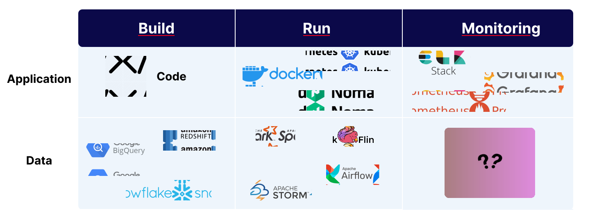

<p align="center">
    
</p>
<p align="center"><b>Open Source Data Quality Monitoring.</b></p>

<p align="center">
    
    
    
    
    
    
</p>

## What is `datachecks`?

Datachecks is an open-source data monitoring tool that helps to monitor the data quality of databases and data pipelines.
It identifies potential issues, including in the databases and data pipelines. It helps to identify the root cause of the data quality issues and helps to improve the data quality.

Datachecks can generate several metrics, including row count, missing values, invalid values etc. from multiple data sources. Below are the list of supported data sources and metrics.

## Why Data Monitoring?

APM (Application Performance Monitoring) tools are used to monitor the performance of applications. AMP tools are mandatory part of dev stack. Without AMP tools, it is very difficult to monitor the performance of applications.

<p align="center">
    
</p>

But for Data products regular APM tools are not enough. We need a new kind of tools that can monitor the performance of Data applications. 
Data monitoring tools are used to monitor the data quality of databases and data pipelines. It identifies potential issues, including in the databases and data pipelines. It helps to identify the root cause of the data quality issues and helps to improve the data quality.

## Architecture

<p align="center">
    
</p>

## What Datacheck does not do?

<p align="middle">
  
</p>

## Metric Types

| Metric                           | Description                                                                                                      |
|----------------------------------|------------------------------------------------------------------------------------------------------------------|
| **Reliability Metrics**          | Reliability metrics detect whether tables/indices/collections are updating with timely data                      |
| **Numeric Distribution Metrics** | Numeric Distribution metrics detect changes in the numeric distributions i.e. of values, variance, skew and more |
| **Uniqueness Metrics**           | Uniqueness metrics detect when data constraints are breached like duplicates, number of distinct values etc      |
| **Completeness Metrics**         | Completeness metrics detect when there are missing values in datasets i.e. Null, empty value                     |
| **Validity Metrics**             | Validity metrics detect whether data is formatted correctly and represents a valid value                         |

## Getting Started

Install `datachecks` with the command that is specific to the database.

### Install Datachecks

To install all datachecks dependencies, use the below command.
```shell
pip install datachecks -U
```

### Postgres

To install only postgres data source, use the below command.
```shell
pip install datachecks 'datachecks[postgres]' -U
```

### OpenSearch

To install only opensearch data source, use the below command.
```shell
pip install datachecks 'datachecks[opensearch]' -U
```

## Running Datachecks

Datachecks can be run using the command line interface. The command line interface takes the config file as input. The config file contains the data sources and the metrics to be monitored.
```shell
datachecks inspect -C config.yaml
```


## Datachecks Configuration File

### Data Source Configuration

Declare the data sources in the `data_sources` section of the config file.
The data sources can be of type `postgres` or `opensearch`.

### Environment Variables in Config File

The configuration file can also use environment variables for the connection parameters. To use environment variables in the config file, use the `!ENV` tag in the config file like `!ENV ${PG_USER}`

### Example Data Source Configuration

```yaml
data_sources:
  - name: content_datasource        # Name of the data source
    type: postgres                  # Type of the data source
    connection:                     # Connection details of the data source
      host: 127.0.0.1               # Host of the data source
      port: 5431                    # Port of the data source
      username: !ENV ${PG_USER}     # Username of the data source
      password: !ENV ${OS_PASS}     # Password of the data source
      database: postgres            # Database name of the data source
```

### Metric Configuration

Metrics are defined in the `metrics` section of the config file.

```yaml
metrics:
  content_datasource:               # Reference of the data source for which the metric is defined
    count_content_hat:              # Name of the metric
      metric_type: row_count        # Type of the metric
      table: example_table          # Table name to check for row count
      filter:                       # Optional Filter to apply on the table before applying the metric
        where_clause: "category = 'HAT' AND is_valid is True"
```

## Supported Data Sources

Datachecks supports sql and search data sources. Below are the list of supported data sources.

### PostgreSQL
Postgresql data source can be defined as below in the config file.

```yaml
data_sources:
  - name: content_datasource     # Name of the data source
    type: postgres               # Type of the data source
    connection:                  # Connection details of the data source
      host:                      # Host of the data source
      port:                      # Port of the data source
      username:                  # Username of the data source
      password:                  # Password of the data source
      database:                  # Database name of the data source
      schema:                    # Schema name of the data source
```

### OpenSearch

OpenSearch data source can be defined as below in the config file.

```yaml
data_sources:
  - name: content_datasource     # Name of the data source
    type: opensearch             # Type of the data source
    connection:                  # Connection details of the data source
      host:                      # Host of the data source
      port:                      # Port of the data source
      username:                  # Username of the data source
      password:                  # Password of the data source
```

### [Work In Progress] Data Source Integrations
- **MySql**
- **MongoDB**
- **Elasticsearch**
- **GCP BigQuery**
- **AWS RedShift**

## Supported Metrics

### Numeric Metrics
By using a numeric metric to perform basic calculations on your data, you can more easily assess trends.

| Metric           | Description                                              |
|------------------|----------------------------------------------------------|
| `row_count`      | The number of rows in a table.                           |
| `document_count` | The number of documents in a document db or search index |
| `max`            | Maximum value of a numeric column                        |
| `min`            | Minimum value of a numeric column                        |

#### How to define numeric metrics in datachecks config file?

For SQL data sources, the numeric metric can be defined as below.
```yaml
  <Datasource name>:
    <Metrics name>:
      metric_type: <Metric type>      # Type of NUMERIC metric
      table: <Table name>             # Table name to check for numeric metric
      field: <Field name>             # Field name to check for numeric metric
      filter:                         # Optional Filter to apply on the table
        where_clause: <Where clause>  # SQL Where clause to filter the data before applying the metric
```
For Search data sources, the numeric metric can be defined as below.
```yaml
  <Datasource name>:
    <Metrics name>:
      metric_type: <Metric type>      # Type of NUMERIC metric
      index: <Index name>             # Index name to check for numeric metric
      field: <Field name>             # Field name to check for numeric metric
      filter:                         # Optional Filter to apply on the index
        search_query: <Search Query>  # Search Query to filter the data before applying the metric
```

### Freshness Metrics
Data freshness, sometimes referred to as data timeliness, is the frequency in which data is updated for consumption.
It is an important data quality dimension and a pillar of data observability because recently refreshed data is more accurate, and thus more valuable

#### How to define freshness in datachecks config file?

For SQL data sources, the freshness metric can be defined as below.
```yaml
  <Datasource name>:
    last_updated_row <Metrics name>:
      metric_type: freshness      # Type of metric is FRESHNESS
      table: category_tabel       # Table name to check for freshness check if datasource is sql type
      field: last_updated         # Field name to check for freshness check, this field should be a timestamp field
```

For Search data sources, the freshness metric can be defined as below.
```yaml
  <Datasource name>:
    last_updated_doc <Metrics name>:
      metric_type: freshness      # Type of metric is FRESHNESS
      index: category_index       # Index name to check for freshness check if datasource is search index type
      field: last_updated         # Field name to check for freshness check, this field should be a timestamp field
```